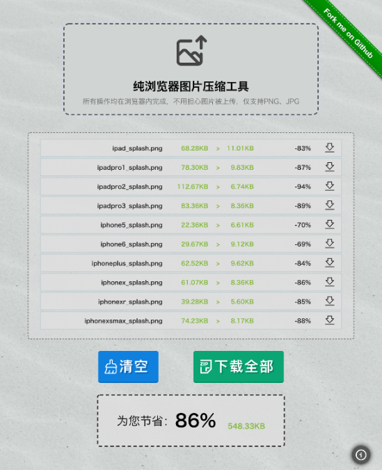

# 浏览器端图片压缩工具

访问地址：[https://icfe.yangerxiao.com/](https://icfe.yangerxiao.com/)

注：该工具不仅会压缩大小，还会自动压缩尺寸（宽高超过 750px 会被压缩）。另，目前该产品还处于试验阶段，请根据压缩后的具体效果酌情使用。

## 特性

- 浏览器压缩图片，不会有图片上传到服务器
- 批量上传&压缩
- 批量打包下载
- 压缩的图片会同时满足两个条件：小于 400KB & 宽高小于 750px

## TODO

- 压缩参数可自定义
- 国际化
- 压缩后图片预览
- 无压缩列表时的展现：放个对比图
